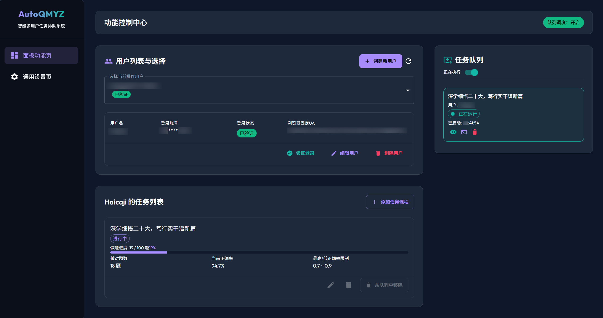
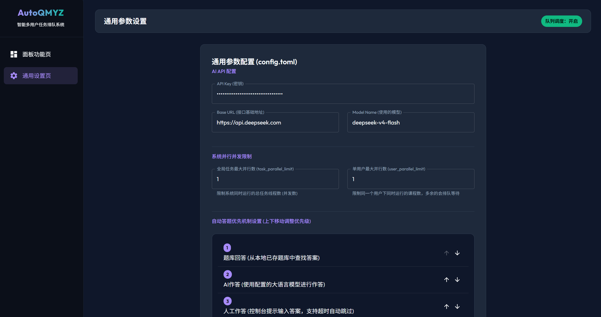
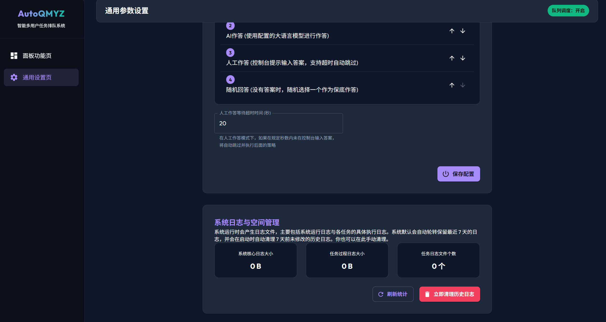
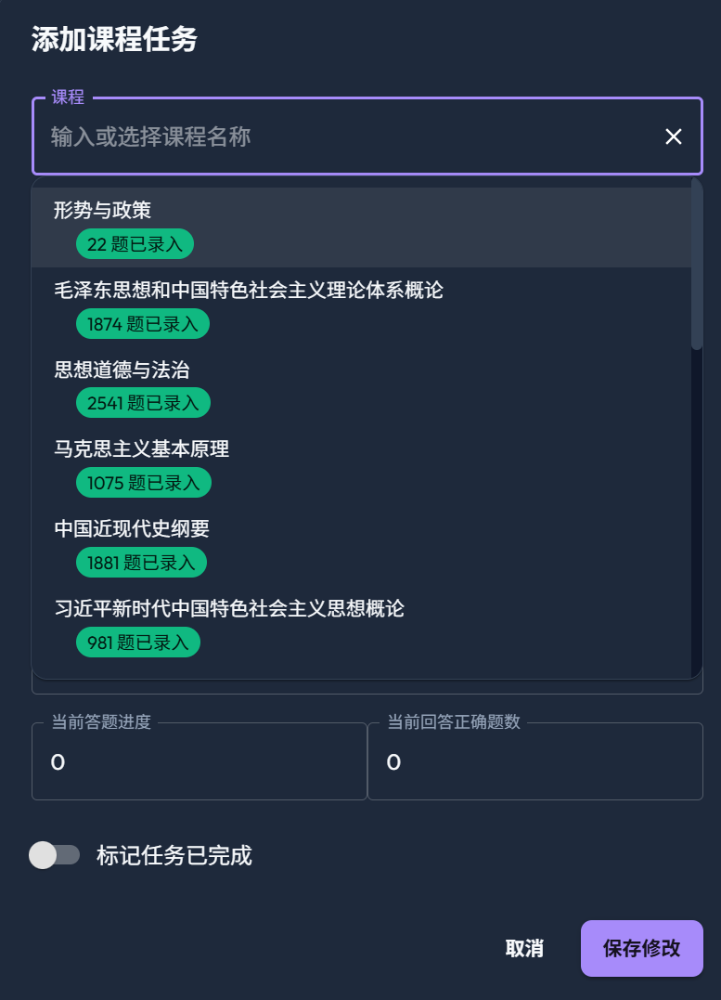
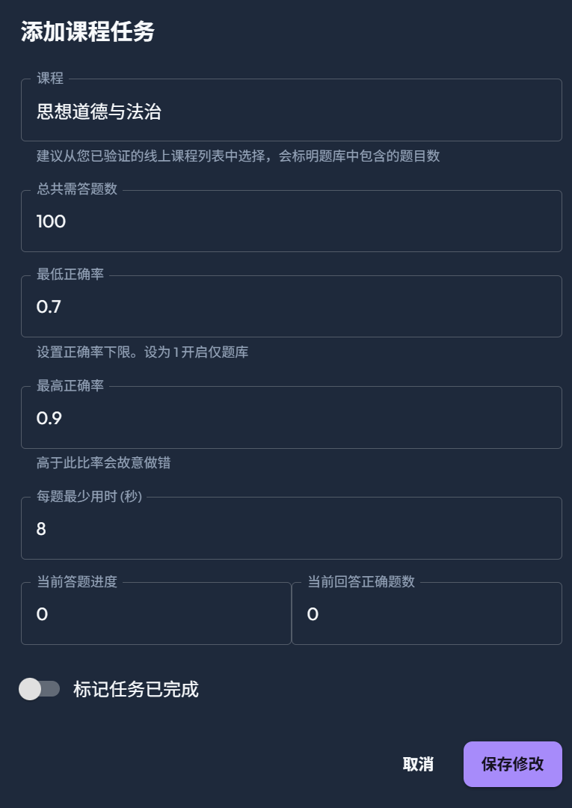

# AutoQMYZ

青马易战自动答题脚本, [Github 项目地址](https://github.com/Haicaji/AutoQMYZ)

> [!WARNING]
> **免责声明与安全提示**
> 1. 本项目仅供学习和交流研究使用，请勿用于任何商业用途或非法途径。
> 2. 用户在下载、修改、分发或使用本软件时，必须自行承担由于使用本软件而导致的任何形式的风险、责任和后果（包括但不限于账号受限、成绩无效、系统封禁等）。
> 3. 本项目作者与“青马易战”官方无任何关联。项目提供的所有自动化机制（如防检测、模拟答题等）仅作为学术研究和浏览器自动化技术探讨，不保证其绝对安全与稳定。
> 4. 使用本项目前，请确保您已知晓并同意上述条款，否则请立即删除所有相关文件。


## 版权声明

遵循 AGPL v3.0 协议

## 功能支持

- 多用户登录, 多任务并行
- AI/题库/人工/随机四种答题模式随意调整顺序
- 正确率/速率多维度控制
- UA 固定
- 自动化过程可视化







## 快速开始（Release 版本）

> 推荐大多数用户使用此方式，无需安装 Python 环境。

### 1. 下载

前往 [Releases](../../releases) 页面，下载最新版本的 `AutoQMYZ-vX.X.X.zip`。

### 2. 解压

将 zip 文件解压到任意英文路径目录（建议路径中不要包含中文或空格）。解压后目录根部应直接包含 `AutoQMYZ.exe`。

### 3. 配置 AI API

编辑根目录下的 `config.toml`(或者进入WebUI进行配置)，填入你的 API 密钥和模型信息。支持 OpenAI 兼容的各大 AI API（OpenAI、DeepSeek、通义千问、Gemini 等）：

```toml
[ai]
api_key = "你的API密钥"
base_url = "https://api.deepseek.com"     # 可替换为其他兼容 API 地址
model = "deepseek-v4-flash"               # 使用的模型名称
```

### 4. 启动程序

双击 `AutoQMYZ.exe` 启动程序。

### 5. 打开管理界面

启动成功后，在浏览器中打开 [http://127.0.0.1:8000](http://127.0.0.1:8000) 即可进入 WebUI 管理界面。

在管理界面中你可以：
- 创建和管理用户
- 配置答题任务（选择课程、设置题数、正确率等）
- 启动/停止答题队列
- 实时查看答题日志
- 修改系统设置

Release 压缩包已经内置以下运行资源，普通用户不需要安装 Python、Node.js、Chrome 或 ChromeDriver：

- `AutoQMYZ.exe`：由 GitHub Actions 在 Windows 上使用 Python 3.12 + PyInstaller 编译
- `Data/Question_data`：随包发布的本地题库
- `WebUI/dist`：已编译的前端静态资源，字体和 UI 组件随前端包本地构建
- `ChromeWithDriver`：便携版 Chrome for Testing、匹配的 ChromeDriver，以及 `stealth.min.js` 反检测脚本
- `config.toml`、`README.md`、`LICENSE`

## 目录结构

```
AutoQMYZ/
|-- AutoQMYZ.exe                # 主程序（Release 版本，双击运行）
|-- AutoQMYZ.py                 # 主程序源码
|
|-- AutoQMYZ/                   # 核心答题模块
|   |-- QingMYZMain.py          # 主类 QingMYZClass
|   |-- GetAnswerProcessing/    # 获取答案模块
|   |   |-- GetAnswer.py        # 本地题库/AI/人工 获取答案
|   |
|   |-- ImitateProcessing/      # 模拟浏览器操作模块
|   |   |-- Login.py            # 登入
|   |   |-- SubmitAnswer.py     # 提交答案
|   |   |-- GetQuestion.py      # 获取题目
|   |   |-- AfterAnswer.py      # 答题后操作(写入题库)
|   |   |-- IntoAnswerWeb.py    # 进入答题页面
|   |   |-- AntiRobotDetection.py # 防刷题检测
|   |   |-- StandardQuestion.py # 题目标准化
|
|-- ChromeWithDriver/           # 内置 Chrome 浏览器及对应版本驱动
|   |-- chrome.exe
|   |-- chromedriver112.exe
|   |-- stealth.min.js          # 反爬虫检测脚本
|   |-- chrome-version.txt      # CI 打包时使用的 Chrome for Testing 版本
|
|-- Data/                       # 数据文件
|   |-- logs/                   # 运行日志目录(按天轮转)
|   |-- Question_data/          # 存放题库文件
|   |   |-- 课程名称.csv        # 按课程命名的题库文件
|   |-- User/                   # 存放用户登入密钥及配置信息
|
|-- WebUI/                      # Web管理界面
|   |-- dist/                   # 编译后的前端静态文件
|
|-- config.toml                 # 全局配置文件（Release 版本会由模板生成）
|-- config.toml.template        # 配置模板
|-- README.md
```

## 开发者指南

如果你希望从源码运行或参与开发：

### 环境要求

- Python 3.12+
- Node.js 22+（或 20.19+）

### 安装依赖

```bash
# Python 依赖
pip install -r requirements.txt

# 前端依赖（如需修改 WebUI）
cd WebUI
npm install
npm run build
```

### 运行

```bash
python AutoQMYZ.py
```

### 发布新版本

推送一个以 `v` 开头的 tag 即可自动触发 GitHub Actions 构建并发布 Release：

```bash
git tag v1.0.0
git push origin v1.0.0
```

也可以在 GitHub Actions 页面手动触发 **Build and Release** workflow，输入版本号即可自动创建 tag 并发布。

Release workflow 会执行以下打包步骤：

1. 使用 Python 3.12 安装依赖并通过 PyInstaller 编译 `AutoQMYZ.py` 为 `AutoQMYZ.exe`
2. 使用 Node.js 22 执行 `npm ci` 和 `npm run build`，生成 `WebUI/dist`
3. 下载 Chrome for Testing 稳定版和匹配 ChromeDriver，复制到 `ChromeWithDriver`
4. 复制题库、配置模板、README、LICENSE 和源码目录
5. 校验 zip 中是否包含 exe、题库、前端产物、Chrome、ChromeDriver 和 `stealth.min.js`
6. 上传 `AutoQMYZ-vX.X.X.zip` 到 GitHub Release

## 相关项目

- https://github.com/shibig666/QMYZ
- https://github.com/Xuuyuan/QingmaKiller
- https://github.com/shibig666/QMYZ_Android
- https://github.com/ZeroNinx/QM_Terminator
- https://github.com/shibig666/QMYZ-MCP